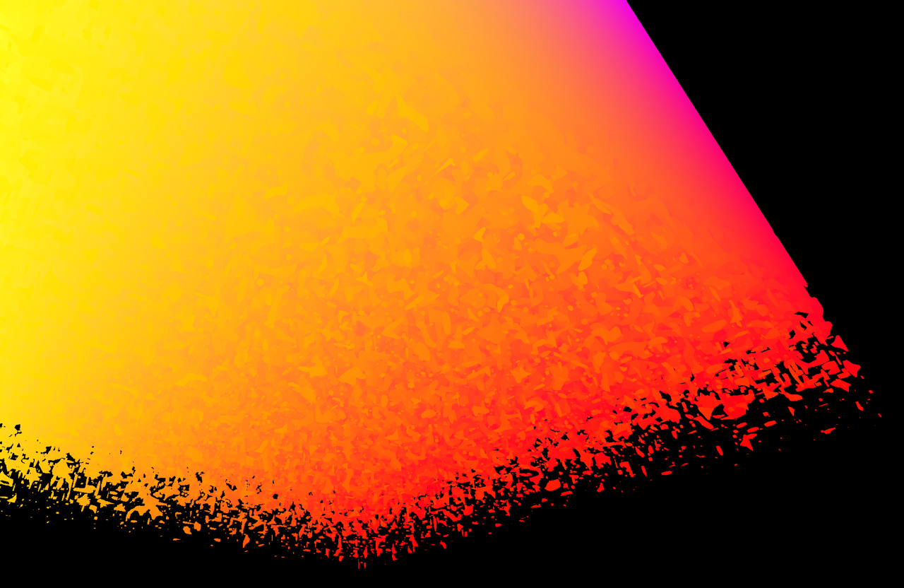
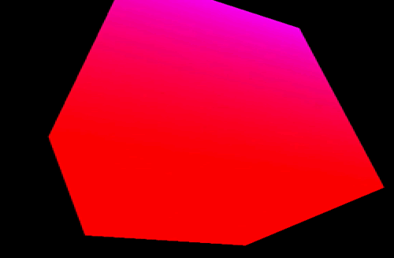
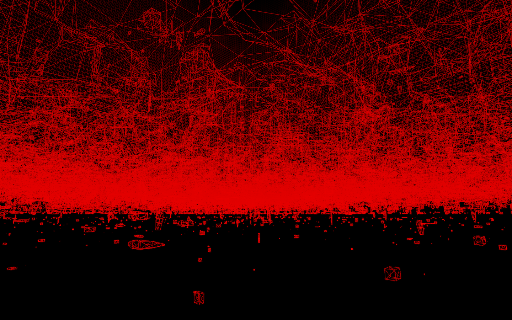
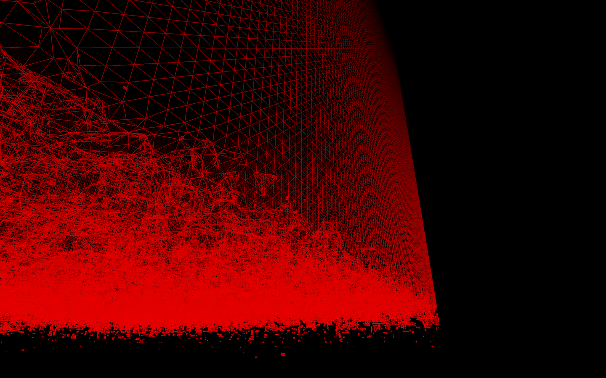
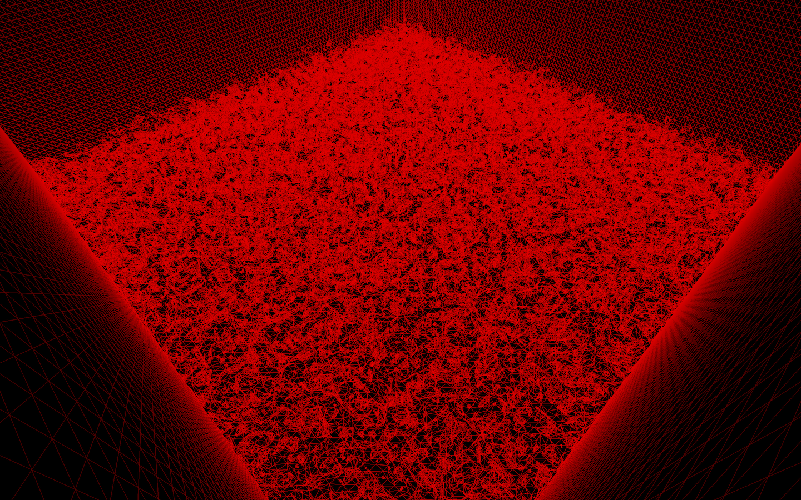
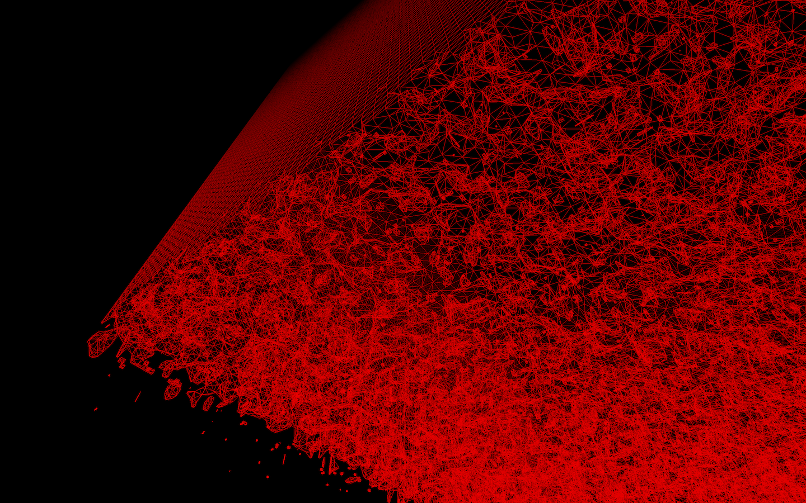
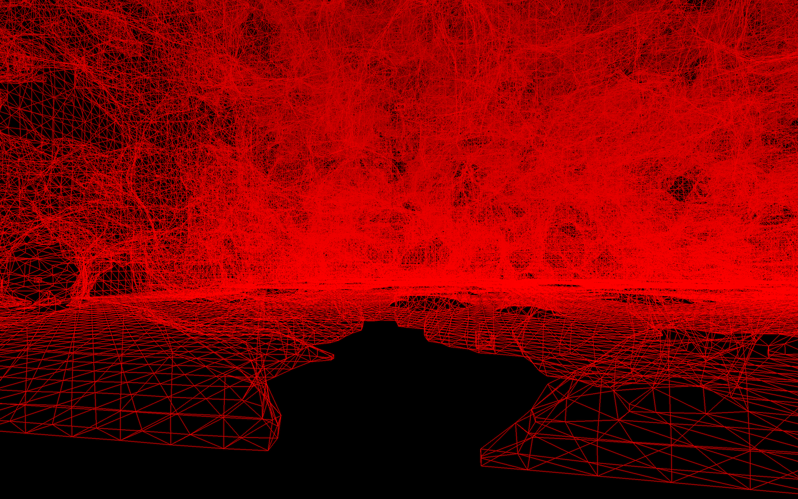
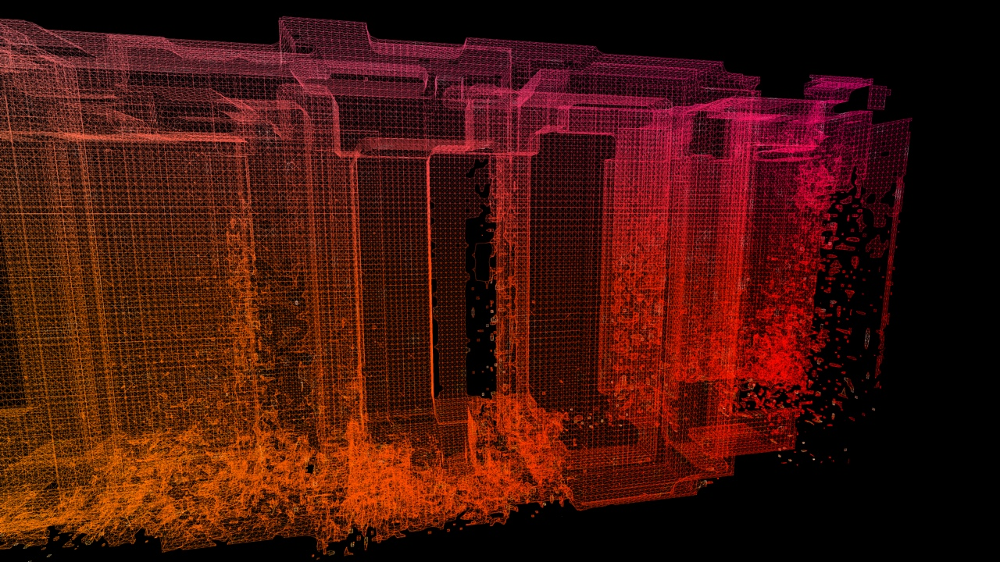

# BRU-12

An experimental [Cinder](https://www.libcinder.org/) + [OpenVDB](http://www.openvdb.org/) toolchain for doing realtime volumetric processing. Research project.

OpenVDB is an industrial-grade data structure used for parallel processing of very large amounts of volumetric ("voxel") data. It's not really intended to be used for real-time rendering, but its design (and performance!) was interesting to me so I decided to try to implement a simple data pipeline on top of it. Modern real-time graphics are quite often "slaves" to the internal data structure used to represent geometry – the mesh. I wanted to try a different approach.

This repo contains a working Cinder app (developed on macOS w/ Xcode) which implements a queue-based pipeline on top of a couple of very generic base classes (see [Queue.hpp](src/beton/Queue.hpp), [Stage.hpp](src/beton/Stage.hpp), [StageProcessor.hpp](src/beton/StageProcessor.hpp)). Each step in the pipeline performs a well-defined, encapsulated operation based on immutable input data read from the input queue, and then puts the result onto the output queue.

Currently the [Muncher](src/pipeline/Muncher.cpp) stage performs a predetermined number of randomized volumetric addition operations on the OpenVDB tree, followed by randomized subtraction operations on it. Then the [Decay](src/pipeline/Decay.cpp) stage takes the modified tree and decays it at each iteration step, gnawing away at the volume from below.

For a glimpse of the potential this pipelined approach has, check out this GIF:

(This is commit 4cb28d5d43caf5b977c6d2ed1d5d1c14e92060d6.)

The pipelined processing for this volumetric cube was running on just one thread, and yet it was able to achieve realtime rendering fidelity. Admittedly, the tree resolution was not that big, but this approach has lots of potential if one were to partition the OpenVDB tree, apply operations to it in parallel, and then merge the results back into one tree again before it's passed to the meshing stage. I moved on to another project before implementing this, c'est la vie.

## License

Feel free to use the code however you wish. If I'm ever to return to it at some point, I'd rewrite it in Rust. It is the future.

## Screenshots

